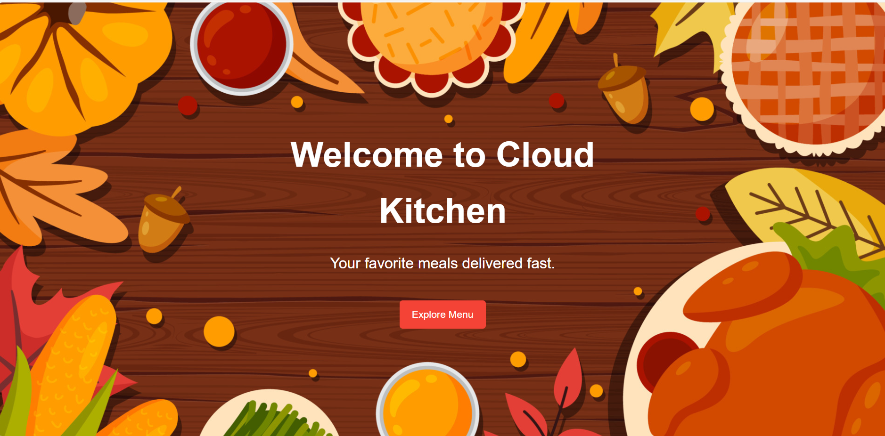

# 🌟 Sriman Subash Portfolio
# My README
Welcome to my portfolio! You can explore all my projects and work here:  
[**Visit My Portfolio**](https://srimansubash.github.io/Portfolio/)

---

## 🚀 Projects

### 1. Cloud Kitchen 

**Description:**  
A web-based system to manage a cloud kitchen. Features include menu management, sales report, and payment integration.  
**Live Demo:** [Click Here](https://srimansubash.github.io/Cloudkitchen/ )  
**Code Repository:** [GitHub Repo](https://github.com/srimansubash/Cloud-Kitchen)

---

### 2. Cab Management System

**Description:**  
A simple cab management system built with PHP. This demo version works without a database to showcase the frontend.  
**Live Demo:** [Click Here](https://srimansubash.github.io/CabManagementSystem/)  
**Code Repository:** [GitHub Repo](https://github.com/srimansubash/Cab-Management-System)

---

## 📂 How to Explore My Work [🔝](#my-readme)
1. Visit the portfolio link above.  
2. Click on the project links to see **live demos**.  
3. Check the GitHub repositories for **source code**.

---

## ✨ Skills & Technologies [🔝](#my-readme)

### Frontend

### Backend

### Databases

### Tools

---

## 📫 Connect with Me [🔝](#my-readme)
- GitHub: [srimansubash](https://github.com/srimansubash)  
- Portfolio: [https://srimansubash.github.io/Portfolio/](https://srimansubash.github.io/Portfolio/)
